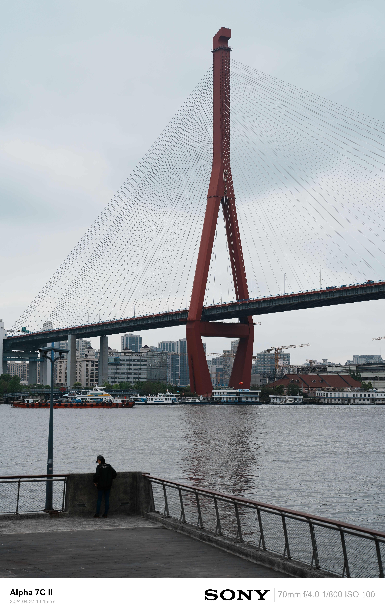
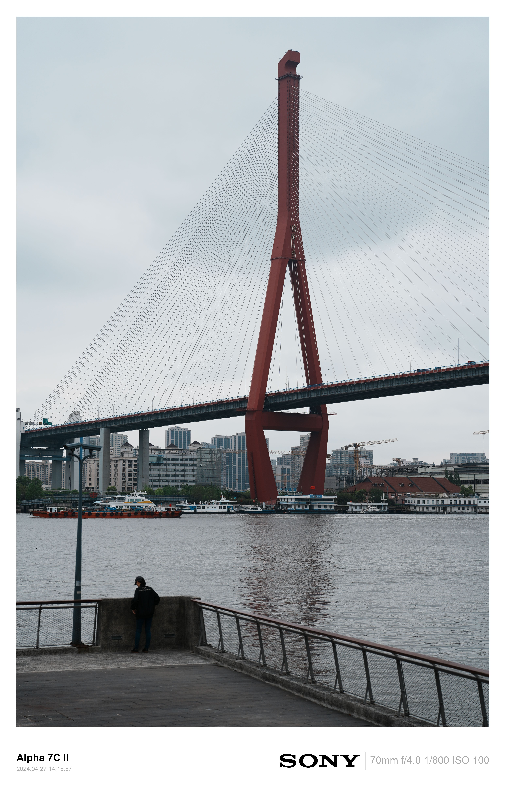
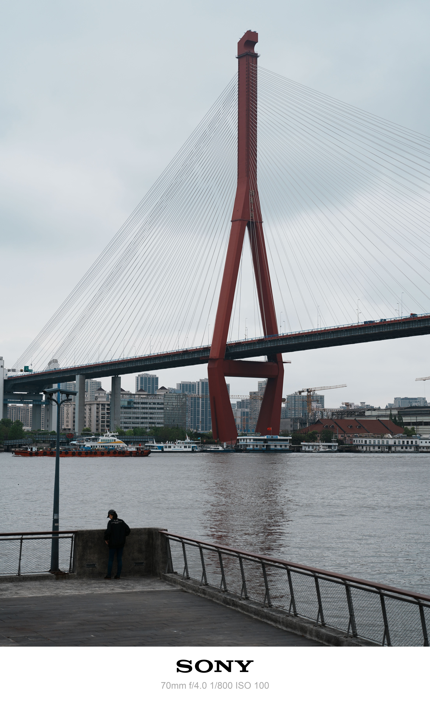
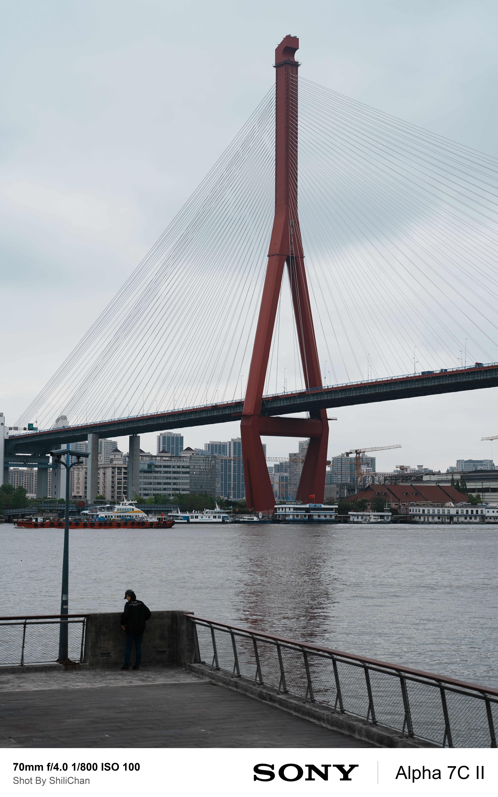
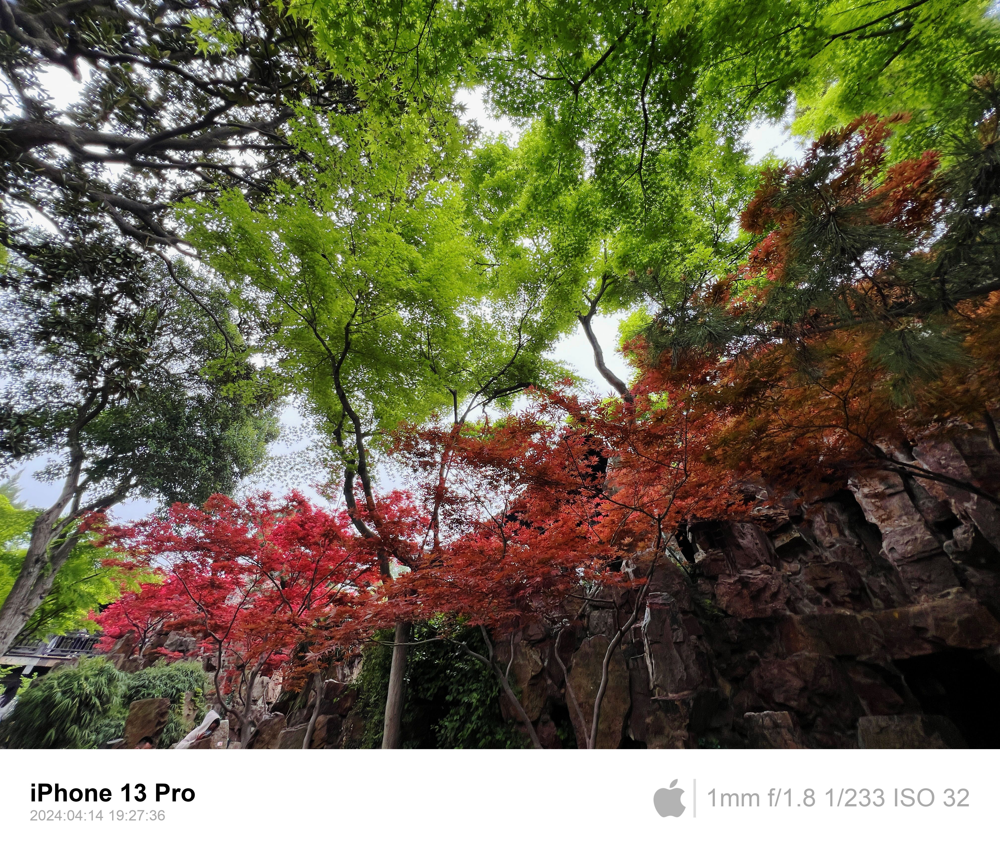
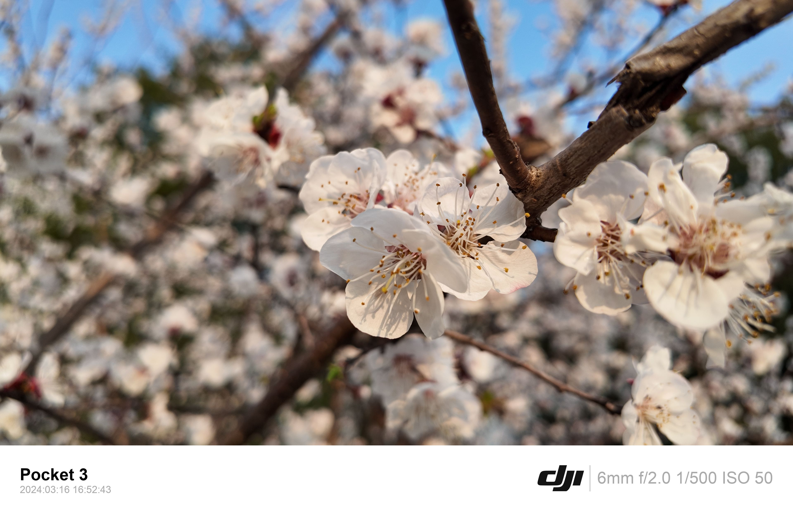

# image-metadata-watermark


## Usage

```python
# -i input folder
# -o output folder
# -s style type
# -a author name
# -q quality 100为原图，不输入默认100
python3 cli.py -i prev/ -o after/ -s 1 -q 80
python3 cli.py -i prev/ -o after/ -s 2 -q 80
python3 cli.py -i prev/ -o after/ -s 3 -q 80
python3 cli.py -i prev/ -o after/ -s 4 -a ShiliChan -q 80
```

## Know Issues
- 基于https://github.com/lovemegowin/image-metadata-watermark 进行开发
- 在作者原代码的基础上做出的改动包括但不限于：
	- 支持Pillow10以上的版本
	- 支持Sony、Canon、大疆、iphone相机的照片边框水印添加
	- 调整了水印样式
	- 增加了Style1、2、3、4,共4种边框风格，可供使用者选择.
	- Style4支持输入创作者名称（仅英文）
	- 针对索尼A7C2设备，显示的设备名称从ILCE-7CM2改为Alpha 7C II
	- 针对大疆Pocket3设备，显示的设备名称从PP-101改为Pocket 3
	- 支持自定义输出图片的质量，100为原图，数字小于100进行压缩


## Example
### Before process Sony


### After process Sony Style1


### After process Sony Style2


### After process Sony Style3


### After process Sony Style4


### After process Canon Style1


### After process Apple Style1


### After process Dji Style1


